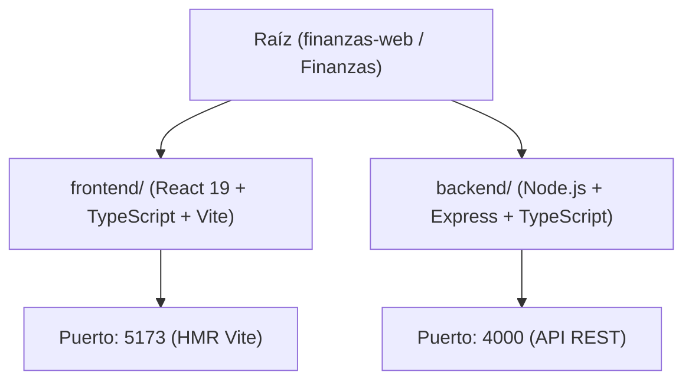

# 📊 Reporte de Configuración: Finanzas Web (Monorepo)

**Fecha:** 11 de Septiembre, 2026  
**Repositorio:** [github.com/DanSteven12/Finanzas](https://github.com/DanSteven12/Finanzas.git)  
**Arquitectura:** Monorepo con Yarn Workspaces (Frontend + Backend desacoplados)

---

## 1. 🎯 Resumen Ejecutivo

Se completó la inicialización y estructuración integral del proyecto **Finanzas Web**. El proyecto permite gestionar y escalar de forma independiente la interfaz de usuario y los servicios del backend, compartiendo un único flujo de comandos en la raíz mediante **Yarn Workspaces**.

---

## 2. 🏗️ Arquitectura y Tecnologías



### Componentes:
- **Root Monorepo:** Gestión centralizada de scripts concurrentes (`concurrently`) y resolución de dependencias compartidas con `yarn`.
- **Frontend (`frontend/`):** Construido sobre React 19 con TypeScript y Vite. Contiene el sistema de diseño y paleta de colores corporativa.
- **Backend (`backend/`):** API REST estructurada con Node.js, Express y TypeScript, compilada y recargada automáticamente mediante `ts-node-dev`.

---

## 3. 🎨 Sistema de Diseño y Tokens de Color

Se implementó el sistema de diseño en `frontend/src/index.css` utilizando la paleta seleccionada:

| Muestra | Nombre | Código HEX | Rol UI |
| :---: | :--- | :--- | :--- |
| 🟦 | **Petróleo Oscuro** | `#073540` | Encabezados, tipografía primaria, botones oscuros, navbar |
| 🟩 | **Menta Esmeralda** | `#59D9B5` | Botones de acción principales, indicadores positivos, acentos |
| 🩵 | **Aqua Brillante** | `#99F2E9` | Resaltados, estados interactivos (*hover*), gradientes |
| 🩵 | **Aqua Pastel** | `#C9F2EB` | Tarjetas secundarias, badges suaves, fondos de chips |
| ⬜ | **Gris Base** | `#F2F2F2` | Fondo de la aplicación (*canvas background*) |

---

## 4. 🚀 Flujo para Colaboradores / Clonación

1. **Clonación:**
   ```bash
   git clone https://github.com/DanSteven12/Finanzas.git
   cd Finanzas
   ```
2. **Instalación de paquetes:**
   ```bash
   yarn install
   ```
3. **Ejecución local:**
   ```bash
   yarn dev
   ```

---

## 5. 📦 Scripts del Monorepo

| Comando | Acción |
| :--- | :--- |
| `yarn dev` | Inicia Frontend (`:5173`) y Backend (`:4000`) en paralelo. |
| `yarn dev:frontend` | Inicia únicamente el servidor de desarrollo de Vite. |
| `yarn dev:backend` | Inicia únicamente el servidor de Express con hot-reload. |
| `yarn build` | Genera la compilación de producción del cliente web. |
| `yarn build:backend` | Compila el backend a JavaScript puro en `dist/`. |

---

> [!TIP]
> Todos los cambios han sido preparados para control de versiones en Git y están listos para colaboración en equipo.

